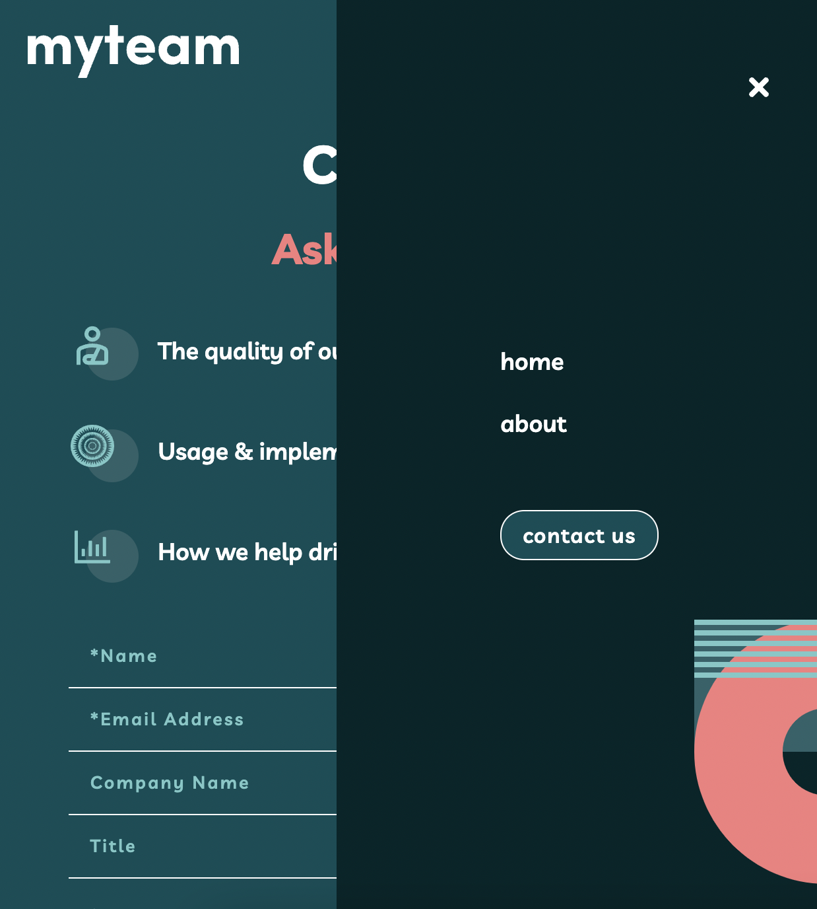
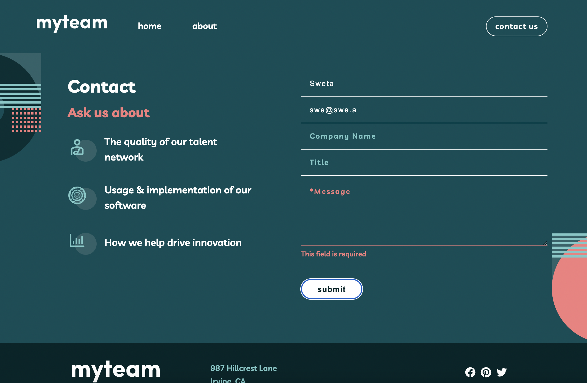

## Myteam multi-page website // Frontend Mentor // React JS

- [see project]()
- Multi-page website with Homepage, About page and a Contact page.
- User can see the correct content for each team member on the About page when the + icon is clicked
- Contact form with validation

    

 

    

 

    

 

    

 
